# 🛒 SuperKart Sales Revenue Forecasting | End-to-End Machine Learning Deployment


---

# Project Overview

SuperKart is a retail chain operating supermarkets and food marts across multiple cities. Accurate sales forecasting enables the business to optimize inventory planning, improve supply chain efficiency, and support regional sales strategies.

This project develops an end-to-end Machine Learning solution that predicts quarterly outlet sales revenue using historical business data. Beyond model development, the solution demonstrates production-oriented deployment by exposing the trained model through a Flask REST API, packaging the application with Docker, and building an interactive Streamlit web interface.

---

# Business Objective

The objective of this project is to:

- Forecast outlet sales revenue
- Improve inventory planning
- Reduce stock shortages and overstocking
- Support regional sales planning
- Demonstrate an end-to-end ML deployment pipeline

---

# Solution Architecture

```mermaid
flowchart LR

A[Historical Sales Data]

B[EDA & Data Preprocessing]

C[Feature Engineering]

D[Model Training]

E[Hyperparameter Tuning]

F[Best ML Model]

G[Model Serialization<br/>Joblib]

H[Flask REST API]

I[Docker Container]

J[Streamlit Dashboard]

K[Business Users]

A --> B
B --> C
C --> D
D --> E
E --> F
F --> G
G --> H
H --> I
I --> J
J --> K
```



---

# Project Workflow

1. Load historical SuperKart sales dataset
2. Perform exploratory data analysis
3. Clean and preprocess data
4. Engineer predictive features
5. Train multiple regression models
6. Optimize model performance through hyperparameter tuning
7. Serialize the best-performing model using Joblib
8. Develop a REST API using Flask
9. Build an interactive Streamlit application
10. Containerize the solution using Docker
11. Deploy to Hugging Face Spaces

---

# Technology Stack

## Machine Learning

- Python
- Scikit-learn
- Pandas
- NumPy

## Data Analysis

- Exploratory Data Analysis (EDA)
- Feature Engineering
- Model Evaluation
- Hyperparameter Tuning

## Deployment

- Flask
- Streamlit
- Docker
- Joblib

## Cloud

- Hugging Face Spaces

---

# Repository Structure

```
superkart-sales-forecast/

│── SuperKart.ipynb

│── README.md

│── requirements.txt

│── backend_files/

│      app.py

│      model.joblib

│

│── deployment_files/

│      streamlit_app.py

│

└── images/
```

---

# Key Features

- End-to-end Machine Learning pipeline
- Exploratory Data Analysis
- Feature Engineering
- Model Selection
- Hyperparameter Optimization
- REST API Development
- Streamlit Dashboard
- Docker Containerization
- Hugging Face Deployment

---

# Skills Demonstrated

- Machine Learning
- Model Deployment
- Flask API Development
- Streamlit
- Docker
- MLOps
- Business Analytics
- Data Visualization
- Hyperparameter Tuning

---

# Business Value

The predictive model enables retail decision makers to:

- Forecast outlet sales
- Optimize inventory levels
- Improve demand planning
- Support regional expansion strategies
- Reduce operational costs

---

# Future Enhancements

- CI/CD Pipeline using GitHub Actions
- Model Monitoring
- MLflow Experiment Tracking
- Automated Retraining Pipeline
- AWS/GCP Deployment
- Kubernetes Deployment
- Real-time Prediction API

---

# Learning Outcomes

This project demonstrates practical implementation of:

- End-to-end Machine Learning Lifecycle
- Production-ready Model Deployment
- REST API Development
- Interactive Data Applications
- Docker Containerization
- Cloud-based AI Deployment

---
